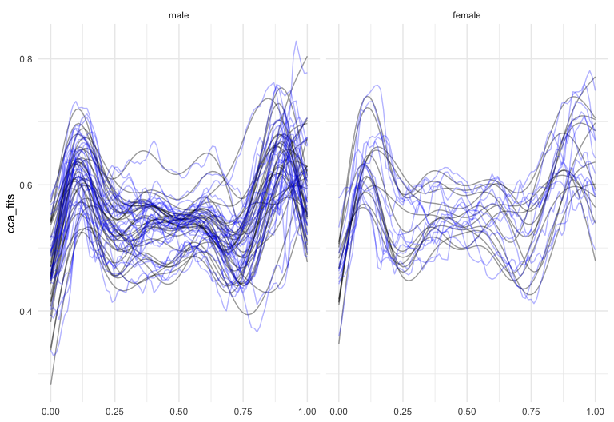

<!-- README.md is generated from README.Rmd. Please edit that file -->

# refundr

<!-- badges: start -->

[](https://travis-ci.org/tidyfun/refundr)
[](https://ci.appveyor.com/project/tidyfun/refundr)
<!-- badges: end -->

The goal of **`refundr`** is to interface **`refund`** and
**`tidyfun`**.

## Installation

``` r
devtools::install_github("tidyfun/refundr")
```

## `rfr_fpca()`

The `rfr_fpca()` function peforms `fpca` using functions from the
`refund` package. The input is a `tfd` column.

Below are examples using the dti and chf datasets.

``` r

library(refundr)
library(tidyfun)
library(tidyverse)

# irregular data 
data(dti_df)
dti_fpca = rfr_fpca(Y = "cca", data = dti_df)

dti_df %>% 
  modelr::add_predictions(dti_fpca, var = "cca_fits") %>% 
  filter(case == "control") %>% 
  ggplot(aes(y = cca_fits)) + 
  geom_spaghetti(alpha = .4) + 
  geom_spaghetti(aes(y = cca), color = "blue", alpha = .3) + 
  facet_grid(~sex)
```



``` r

# regular data
data(chf_df)
dti_fpca = rfr_fpca(Y = "activity", data = chf_df)
```
